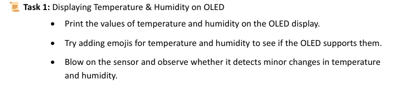
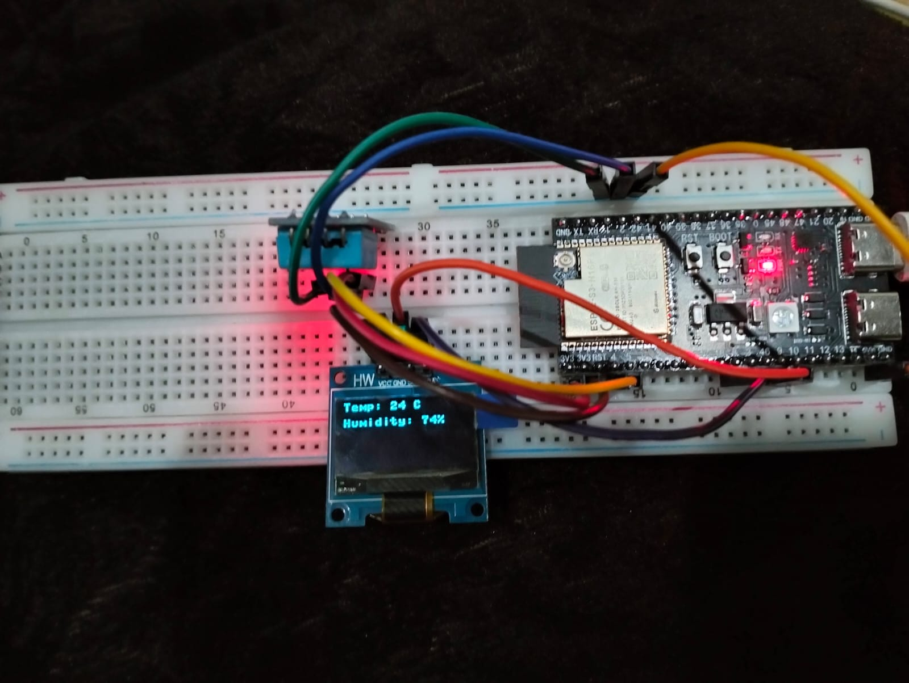
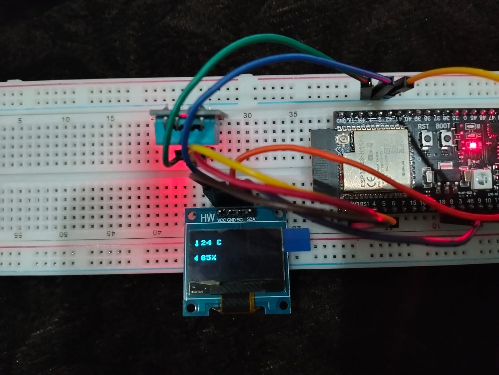
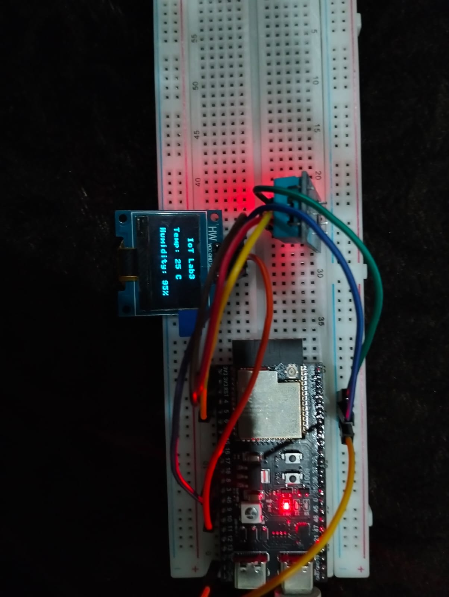
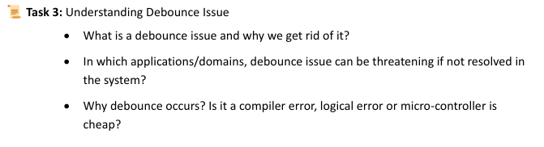
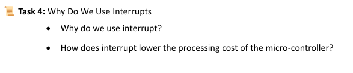

# Iot_Lab3_Home_Task

# Task1_1.1

# Task1_1.2

# Task1_1.3

When i blow in the sensor Humidity increase upto 94%

# Task2

# Task2.1
When we use intrupts it show instant reaction to button press OLED display trun on/off samooth
and we run without intrupts show slight delay since the loop must reach the button check
and show abnormal baheavior
# Task3

# Task3.1
The debounce issue occurs when a mechanical switch like does not make a clean transition between
on/off. when button pressed or released, the switch may bounce multiple times before settling into a stable state.
It give inconsistent or unreliable input readings so we need to rid this behavior.
# Task3.2
Debounce issues can be critical in systems where precise button presses matter like in Medical arospace
where button press in crtical condition is more important
# Task3.3
Debounce occurs due to a hardware issue, NOT because of a compiler error, logical error,
or cheap microcontroller. Even high quality microcontroller face this behavior because 
Buttons are mechanical components with moving parts. When pressed or released, their contacts
physically vibrate before settling that called debonce.
# Task4

# Task4.1
Interrupts allow a microcontroller to respond immediately to external events without constantly 
checking for them improving efficiency and responsiveness.
# Task4.2
Instead of continuously polling for changes the microcontroller can perform other tasks and only 
handle an event when triggered, reducing CPU usage and power consumption.
When We use sleep it block the entire working but intrupts not do this that why its processing cost.
# Wokwi Project Link
https://wokwi.com/projects/423480633847518209